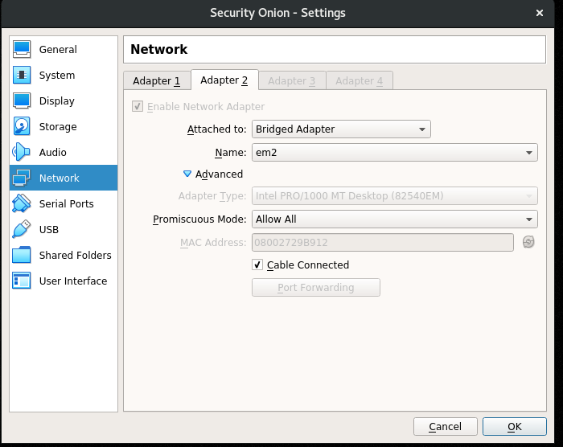

# Linux Notes(The notes are designed terminal usage)
* Emptying trash on Cent
   rm -rf ~/.local/share/Trash/files/*
 * Allowing remote access
     For MongoDB and MySQL you have to edit their config files to allow remote access
     Locating your MySQL config file = mysql --help | grep "Default options" -A 1
     It's the first file from the left(/etc/my.cnf)
     If bind-address isn't there you're fine. (sudo vi /etc/my.cnf)
     You can also add it "bind-address=0.0.0.0" or "bind-address=127.0.0.1" for local host
     I created another user with remote privileges. If you're using root you have to enable remote logins(When your installing MySQL I think you can enable remote                  
  root...I wouldn't enable remote root. It's better to create another user)
     sudo vi /etc/mongod.conf
     change "bindIP: 127.0.0.1" to "bindIP: 0.0.0.0"
     Then restart the service
     sudo systemctl restart mongod
     Find your firewall zone
     firewall-cmd --get-active-zones
     Open 3306 or your custom MySQL port & Mongo
     sudo firewall-cmd --zone=public --add-port=3306/tcp --permanent
     sudo firewall-cmd --zone=public --add-port=27017/tcp --permanent
     reload sudo firewall-cmd --reload
     sudo systemctl restart mysqld && sudo systemctl restart mongod
 * View network information(active ports) & enable http on CentOS
   ss -l(netstat is not on CentOS 7 by default)
   If you cannot access pihole's interface on CentOS firewalld is blocking the connection 
  1. Make sure lighttpd's service is running with (sudo systemctl status lighttpd) if the service is running. Test that the machine is hosting an interface with    curl -I 127.0.0.1 or curl (static ip pihole's configured on) 
  If curl shows that the interface(default webpage) is active, the firewall settings need to be changed.
  2. List your active zone (firewall-cmd --get-active-zones)
  3. Add the service that you'd like unblock to the zone of your choice (sudo firewall-cmd --zone=public --add-service=http)
# Debian 10
If you cannot update your packages/find your sources list. 
[Source list](https://wiki.debian.org/SourcesList)

# Security Onion
 Bridged & Host network settings
 sudo dhclient -v -r
 ip a | grep enp
 sudo ifconfig INTERFACE ip/subnet(10.x.x.x/x) netmask [255.x.x.x] broadcast 10.x.x.255 up
 sudo ifconfig enp0s8 192.168.56.2/24 netmask 255.0.0.0 broadcast 192.168.56.255 up [Example]
 Security onion requires a <b>router(PfSense)</b>, I attempted to configure Security Onion without a router and it didn't work!
 It's incredible how much is logged, with an IDS. 
 Seeing a port scan while your IDS is logging is amazing(granted your the one conducting the scan).
 See NIC Config(Proc must be marked as allow all)
 Upgrading Security Onion 1 to 2 revealed that the hardware requirements changed for production mode.
 =>12GB'S of ram, 4 CPU cores, 200GB'S dynamic(I allocated 100 virtual gb's Security Onion is actually using 9GB'S)
 Keep in mind I'm the only one in my lab I do not know what Security Onion will generate if used in PROD.
 Two NICS are active. These Security Onion notes are designed fr an air gapped lab.

# Fedora
 nmcli is on Fedora by default(Server)
 sudo dnf install NetworkManager-tui | to install nmtui(the GUI of nmcli)

# Kali
 To disable auto suggestion uninstall the plugin. Via the instructions in the repository.[GitHub Repo](https://github.com/zsh-users/zsh-autosuggestions#enable-asynchronous-)
 <b>I'll update the instructions with images. Markdown did not work!</b>
   Auto suggestion will be disabled!
 To install Visual Studio Code. Download the debian package, navigate to your downloads folder and in a terminal execute sudo apt install ./code_versionnumber (while in the packages download location. if not specifiy the folder location)
 
Enable SSH: 
If you'd like to regen the keys follow the steps below. If you don't all you need to is edit the config file and enable certain services.
 
Back up the default keys into a folder. 
sudo mv /etc/ssh/ssh_host_* /etc/ssh/backupKeys/
  Reconfigure the keys: 
sudo dpkg-reconfigure openssh-server
 I ran into an error "rescue-ssh.target is a disabled or a static unit, not starting it." 
I fixed the error by removing the default keys & restarting Kali. 
sudo rm /etc/ssh/ssh_host_* (This command will remove the default keys) 
sudo reboot -h now(restarts Kali) 
sudo nano /etc/ssh/sshd_config 
Uncomment the following lines: 
Port 22 
AddressFamily any 
ListenAddress 0.0.0.0 
PubkeyAuthentication yes 
PasswordAuthentication yes 
Enable the following services:
sudo systemctl start ssh.socket 
sudo systemctl status ssh.socket 
sudo systemctl enable ssh.socket 
sudo systemctl restart ssh.service 
sudo systemctl status ssh.service 
sudo systemctl enable ssh.service 
^ Enables persistence(run every startup).
[LMGSecurity is the source article!](https://www.lmgsecurity.com/enable-start-ssh-kali-linux/)

# Note sources/Credit:
 https://www.tecmint.com
 https://stackoverflow.com/
 https://www.computerhope.com/
 https://www.digitalocean.com/
 Various documentation pages

